# Practica_Sequia
# Edicion de imagen
## Imagen 1:
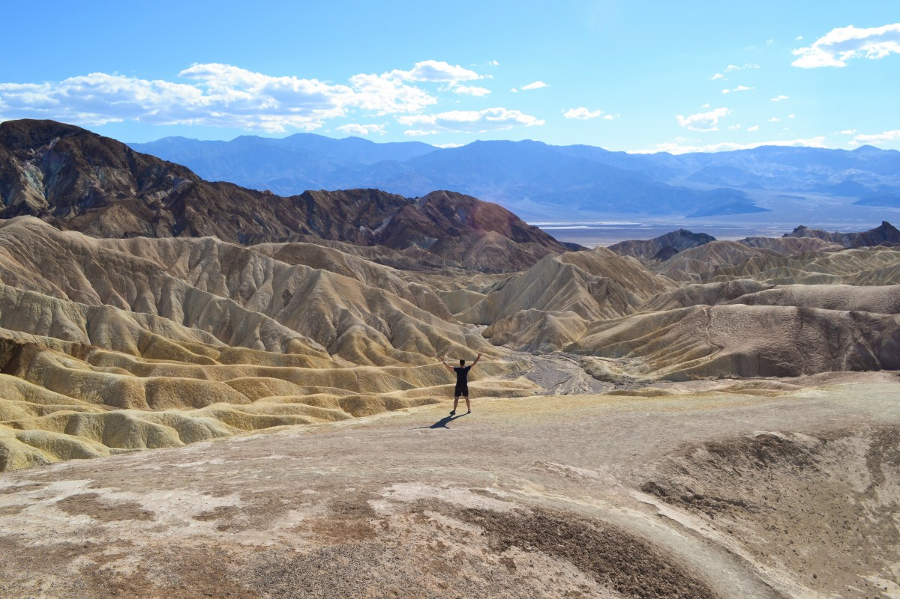

En la primera imagen queremos quitar al hombre, para ello abrimos con gimp la imagen, seleccionamos al hombre y nos vamos a la opción filtros -> mapa -> Resynthesize  con eso borraremos la gran parte del hombre, pero quedarán trozos que no se hayan borrado o no hayan quedado muy bien, esto lo arreglaremos con la herrmienta de clonado.

## Imagen 2:
Lo primero que hacemos es seleccionar toda la parte del cielo y la quitamos, despues editamos el resto de la imagen ajustando un poco el tono y la saturación:
+ Tono: -9
+ Luminosidad: -33
+ Saturación: 37

Por ultimo cortamos el cielo de esta imagen y se la añadimos al embalse de Yesa:

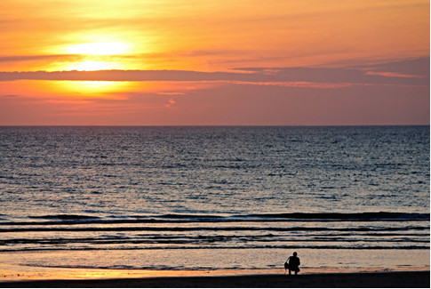

## Imagen 3:

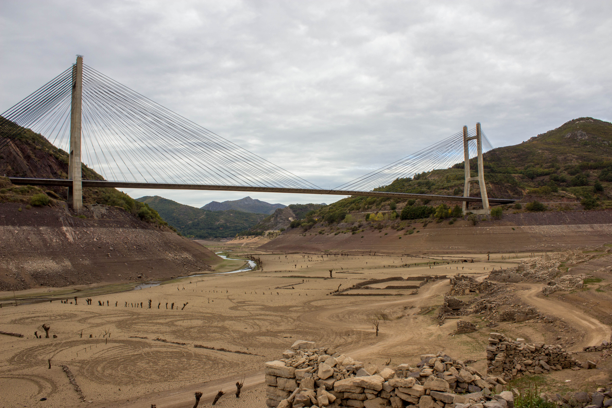

En esta imagen queremos resaltar toda la zona de arena, asi que para ello seleccionamos toda la zona del puente y el cielo y en Colores > Desaturar seleccionamos claridad

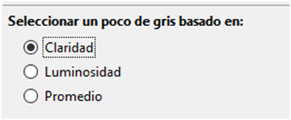

# Edicion de Audio

El clip de audio elegido es bensound-november en mp3.
Lo primero que he hecho ha sido cortar desde el minuto 0 al 1:00, a continuación, he añadido dos efectos de sonido:

+ El primero ha sido añadir eco del sonido que comienza en el segundo 2 al 4 

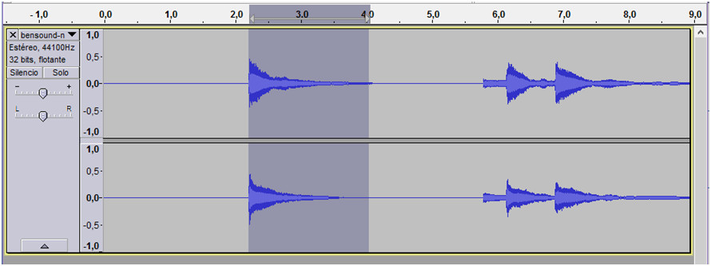

Quedando asi:

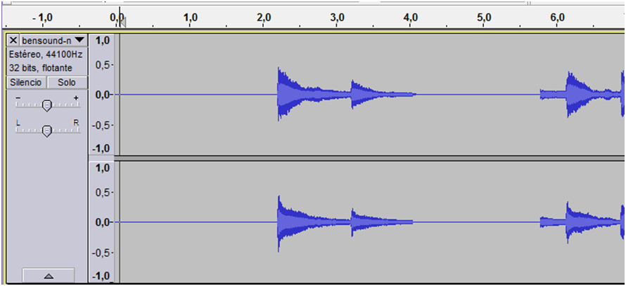

Tambien añadimos el mismo efecto de eco en el sonido del segundo 7 al 8:

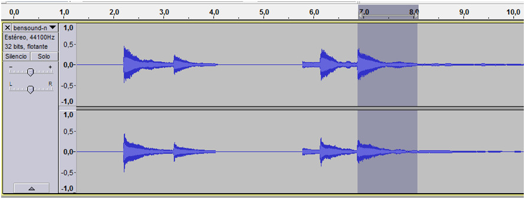

El resultado de añadir el segundo eco seria:

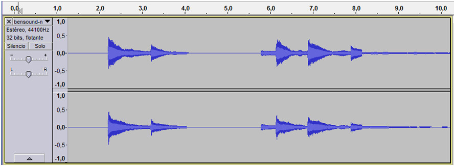

+ El segundo efecto de sonido será cambiar la reverberación, en concreto pondremos a 50 el tiempo de retardo y lo introducimos desde el segundo 12 al 25:

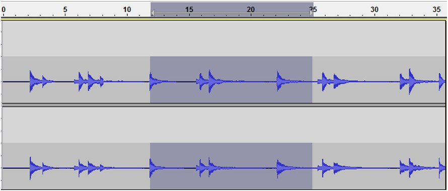

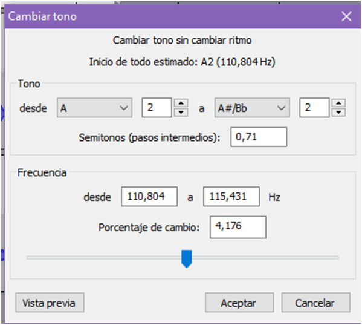

# Edicion de Video

Iniciamos windows movie maker, y ya dentro de el nos aparecen todas las opciones que podemos utilizar, nos vamos a home y en el nos aparece la opción add videos and photos, buscamos el video, y se nos muestra en un espacio en blanco donde se pueden colocar todos los archivos que utilices para editar el video pero como solo necesitamos los archivos de la imagen y el video solo aparecerán ambos.

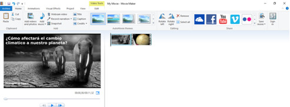

Ya con el video insertado podemos empezar  la edición:
+ Primer efecto: He añadido la imagen al principio del video para que aparezca como portada de inicio del video, después de añadirla he dado click en el video para elegir una transición entre la imagen de portada y el video eligiendo la transición llamada Blur hace una transición en negro pasando al video. Duración del segundo 00.00 al 02.30.

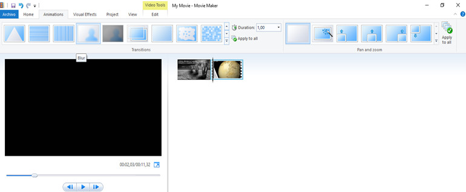

+ Segundo efecto: He añadido una transición que se llama Blur – Through black la cual hace una transición en negro desde el segundo 02.30 al 02.90 apareciendo en este ya la primera imagen del video.

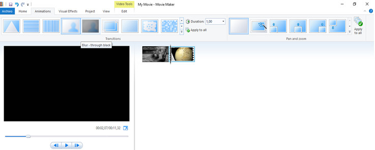

+ Tercer efecto: En la misma pestaña de animations hay un efecto que se llama Pan and zoom he cogido uno de los efectos que se llama Pan down along left el cual va del segundo 02.90 al 11.32 y la imagen de el video se ve aumentada y haciendo un movimiento desde la esquina superior izquierda hacia abajo.

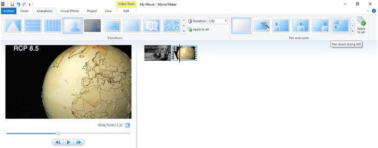

# Edicion de Banner
Lo primero que hacemos es abrir google web desinger y crear un proyecto de la siguiente manera:
+ Anuncios: Banner
+ dimensiones: 300 x 250
+ modo de animacion: avanzado
Le damos a aceptar y seleccionamos las imagenes:

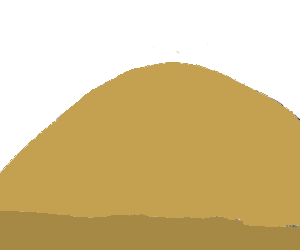

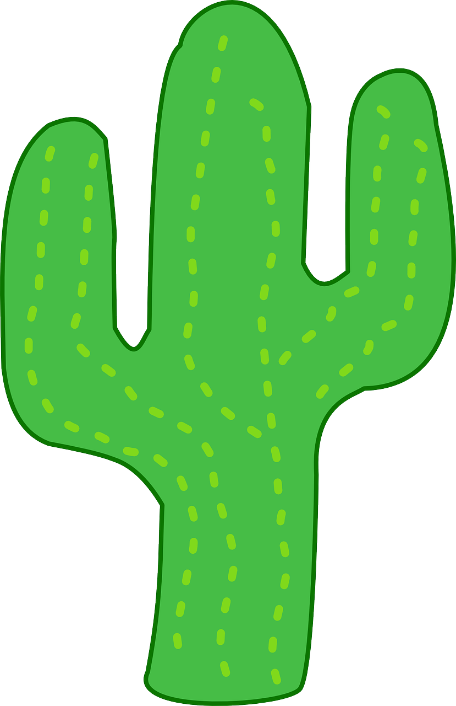

Si fuera necesario, cambiamos el tamaño de las imagenes con la herramienta de control de transformacion, despues visualizamos la linea del tiempo y empezamos a mover las imagenes para crear los efectos:
1. primero haremos que aparezca la montaña desde la izquierda y la duración será de 0 a 1 segundo, a su vez haremos que aparezca un cielo azul desde el segundo 1 hasta el segundo 3.
2. hacemos aparecer el cactus desde la esquina inferior derecha desde el segundo 1 hasta el 2.
3. hacemos aparecer el sol desde el techo de la imagen desde el segundo 2 al 3 y a su vez hacemos que rote suavemente desde el segundo 3 al 7.
4. Con la herramienta de texto, creamos el mensaje del banner "Ayuda a prevenir el cambio climatico" con la fuente indie flower y un tamaño de 24 px. haremos que aparezca desde el segundo 5 al 7.
5. Creamos un area de selección y le añadimos un evento que nos dirigira a la [pagina de sequía en wikipedia.](https://es.wikipedia.org/wiki/Sequ%C3%ADa)
6. situamos el boton de "click aqui" encima del area de selección creada y hacemos que aparezca desde abajo desde el segundo 5 al 7.

Al final la linea de tiempo queda asi:

